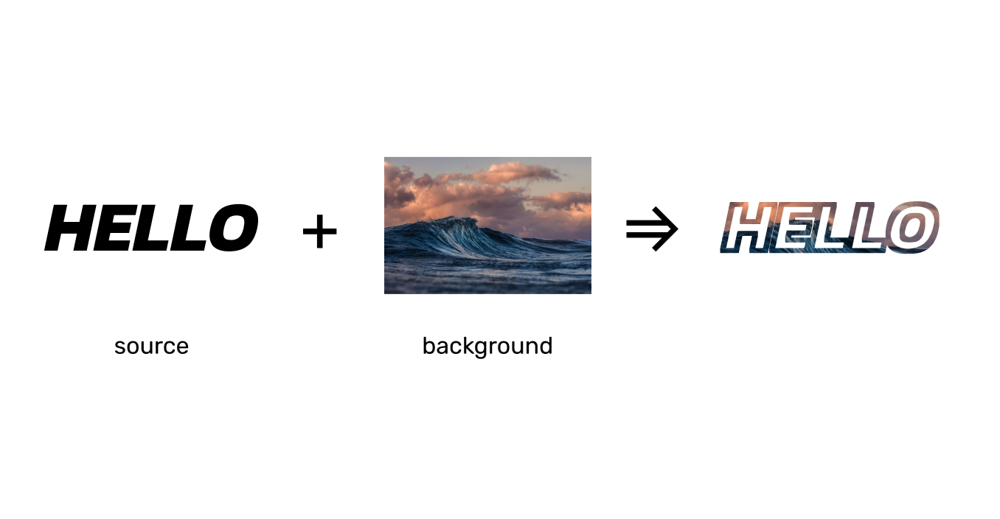

# bmask

Single functionality package for drawing images with a bordered mask.

```go
// Draw creates a canvas and draws a border of specified with around the source image.
// It then uses the canvas as a mask for the background image. The threshold is what
// determines if a pixel should be counted when checking for an edge. Default to 0.
func Draw(source string, background string, lineWidth int, threshold int) error
```

## Example


